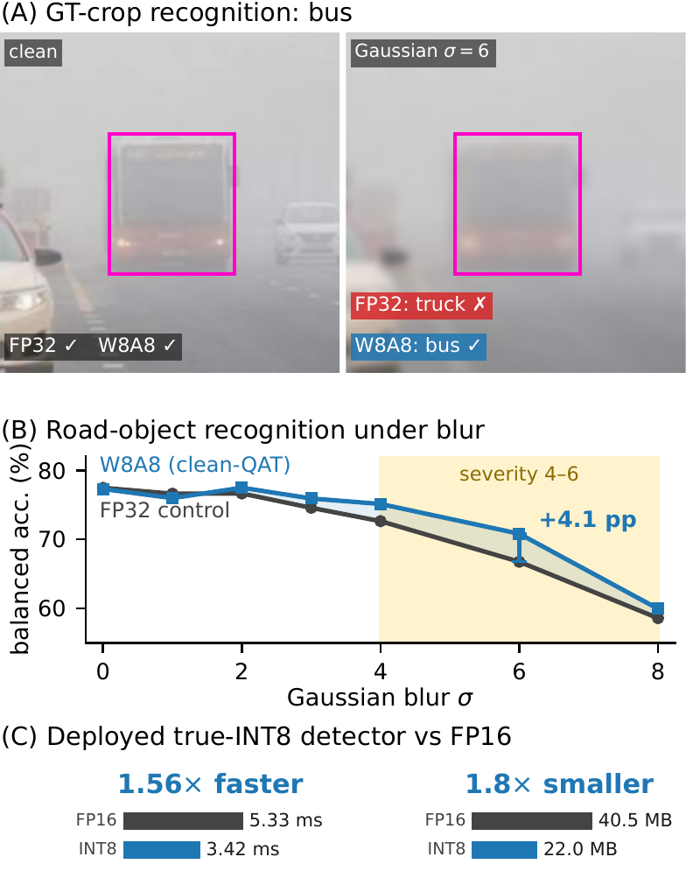
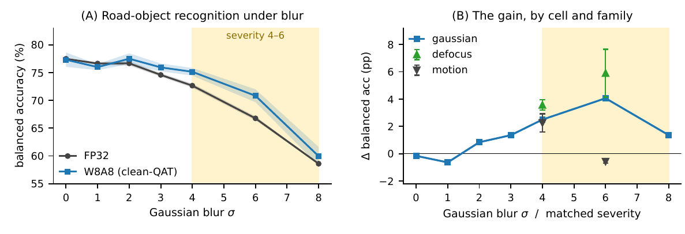
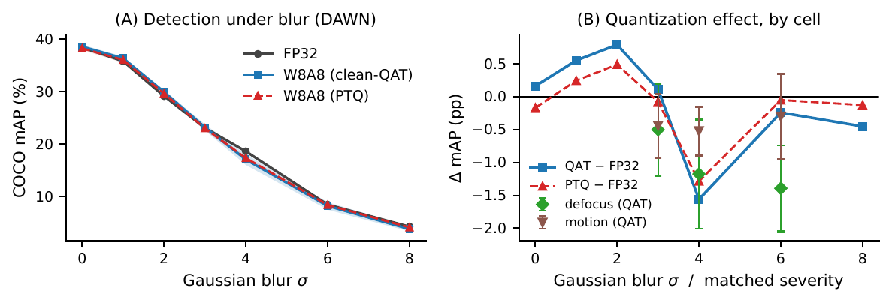
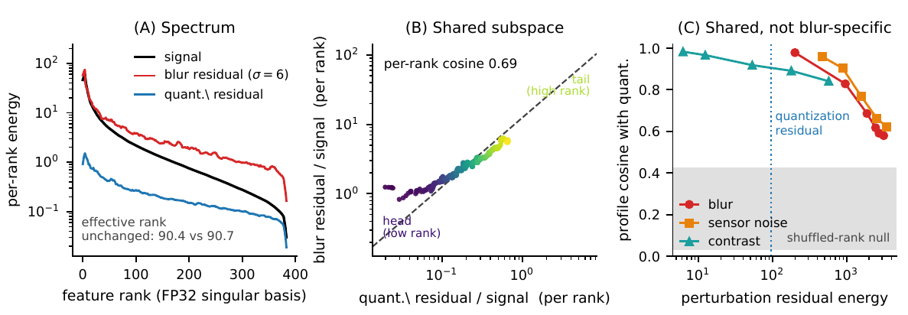
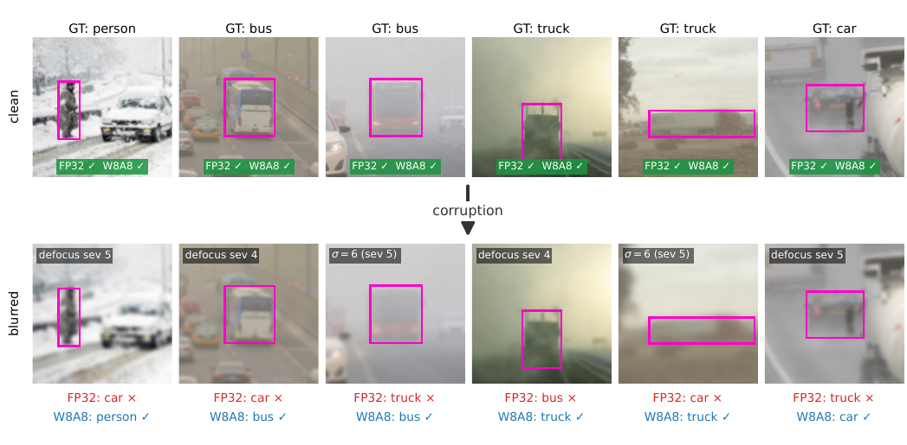
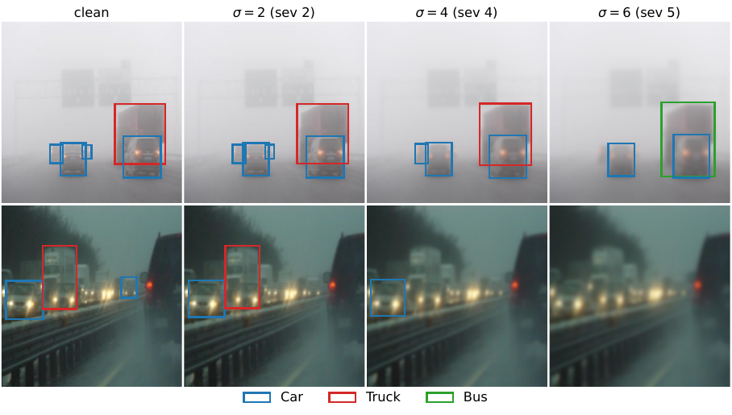

<div align="center">

# Quantization and Corruption Robustness<br>in Deployed Road-Scene Perception

**Copyright © 2026 CEA (Commissariat à l'énergie atomique et aux énergies alternatives)**

**Aymen Bouguerra** · **Ansgar Radermacher** · **Fabio Arnez** · **Chokri Mraidha**

Université Paris-Saclay, CEA-List

[](#-citation) [](LICENSE) [](#-installation) [](#-installation) [](#-installation)



<sub><b>(A)</b> Under Gaussian blur σ=6 the full-precision model calls this bus a truck; the 8-bit model does not.<br>
<b>(B)</b> The quantized encoder is more accurate through the moderate-to-heavy blur window.<br>
<b>(C)</b> Deployed as true INT8, the detector is 1.56× faster and 1.8× smaller.</sub>

</div>

---

Official code for the **IEEE ICVES 2026** paper *Quantization and Corruption Robustness in Deployed
Road-Scene Perception*, accepted as a regular paper. It contains the code of every accuracy, robustness
and mechanism experiment in the paper, and the result files every reported number comes from. The INT8
deployment code is not released; its measurements are included as [result files](#deployment-measurements).

> **TL;DR:** 8-bit quantization is usually assumed to make perception models more fragile. On real
> adverse-weather driving images, it does not: the quantized **detector** is as robust to blur as its
> full-precision counterpart, and a quantized **recognition** encoder is *more* robust, while both run
> faster and smaller as true INT8 models. No corrupted image is ever seen during training.

## 📌 Contents

- [Highlights](#-highlights)
- [Key results](#-key-results)
- [Installation](#-installation)
- [Reproducing the paper](#-reproducing-the-paper)
- [Repository structure](#-repository-structure)
- [Citation](#-citation)
- [License](#-license)

## ✨ Highlights

- 🚗 **Detection is unharmed:** W8A8 RT-DETR stays within **1.7 COCO mAP** of FP32 in all 13 blur conditions.
- 🎯 **Recognition improves:** W8A8 DINOv2 gains **+4.1 pp** at Gaussian σ=6 and **+5.9 pp** at defocus
  severity 5 (balanced accuracy, 3 seeds).
- ⚡ **Faster and smaller:** deployed as true INT8, the detector is **1.56×** faster and **1.8×** smaller;
  the encoders are **1.36–2.13×** faster ([measurements](#deployment-measurements)).
- 🔬 **A mechanism, with controls:** quantization noise and blur perturb the **same high-rank feature
  directions**, and a matched-noise control does *not* reproduce the gain.
- 🧪 **Clean training only:** no synthetically corrupted image is used in training or calibration; blur
  appears at evaluation only.

<details>
<summary><b>Abstract</b></summary>
<br>

Quantization lowers weight and activation precision to fit neural networks onto automotive hardware, and is assumed to cost robustness to degraded camera inputs. For road-scene perception, that cost has never been measured under matched training budgets. On an adverse-weather driving benchmark, a separate 8-bit quantization-aware trained recognition encoder is *more* accurate under moderate-to-heavy Gaussian and defocus blur than its full-precision counterpart by several points of balanced accuracy. It saw no synthetically corrupted image in training and blur only at evaluation. Training does the work, not the arithmetic: a control trained with injected noise of matched magnitude does not reproduce the gain, and training-free quantization reproduces it only in part. We link the effect to a shared feature subspace: quantization noise and blur perturb the same high-rank directions of the representation. A model trained to remain accurate despite its own quantization noise therefore inherits accuracy under blur. The gain is confined to a severity window and reverses once the input is too degraded to read. The detector that ships in the vehicle loses no aggregate robustness under the same quantization and runs faster and smaller as a true INT8 model. The recognition gain therefore comes at no measurable cost to the deployed detector.

</details>

## 📊 Key results

### Recognition becomes more robust to blur it never saw

<p align="center"></p>

A W8A8 DINOv2 ViT-S/14, trained with LSQ on **uncorrupted** crops of DAWN road objects, is more accurate
than its FP32 counterpart through the moderate-to-heavy blur window (bootstrap-significant for Gaussian
and defocus blur). The gain peaks just past severity 5 and reverses once the input is too degraded to read.

### The detector loses nothing

<p align="center"></p>

Under a budget-matched protocol, where FP32, W8A8 QAT and W8A8 PTQ all derive from one converged detector
with the same data, schedule and seeds, the three variants are essentially superposed from uncorrupted input
to near task failure, for Gaussian, defocus and motion blur.

### Quantization noise and blur share a feature subspace

<p align="center"></p>

Both residuals concentrate in the high-rank tail of the representation and fall along a common line, rank
by rank. Training to stay accurate under its own quantization noise gives the model invariance in exactly
the directions blur perturbs.

<details>
<summary><b>Per-object examples:</b> the full-precision model flips, the quantized model does not</summary>
<br>
<p align="center"></p>
</details>

<details>
<summary><b>Detector predictions under increasing blur</b></summary>
<br>
<p align="center"></p>
</details>

## 🛠️ Installation

Tested with **Python 3.12**, **CUDA 12.8** and **PyTorch 2.9.1** on a single NVIDIA RTX 2000 Ada Generation
laptop GPU (8 GB). All latency numbers in the paper come from that GPU.

```bash
git clone https://github.com/CEA-LIST/Quantization-and-Corruption-Robustness-in-Deployed-Road-Scene-Perception.git
cd Quantization-and-Corruption-Robustness-in-Deployed-Road-Scene-Perception
python -m venv .venv && source .venv/bin/activate
pip install -r requirements.txt
```

**Data and models are downloaded automatically.** DAWN (Kenk & Hassaballah, 2020) comes from the Hugging
Face Hub (`Maxim37/dawn-dataset`), as do the pretrained models (`PekingU/rtdetr_r18vd`, DINOv2 ViT-S/14,
`IDEA-Research/grounding-dino-tiny`).

## 🔁 Reproducing the paper

### Result files (no GPU, no data)

The result files in [`results/`](results) are the exact outputs the paper reports. Table I can be
regenerated from them in seconds:

```bash
python analysis/make_det_table.py         # Table I (LaTeX rows)
```

To use your own run instead, pass the path of its `rtdetr_dawn_rob.json` as the first argument.

### Full experiments

Run every script from the repository root; each writes its result JSON to the working directory.

**Detection: RT-DETR on DAWN (Sec. IV)**

```bash
PHASE=ZS  python rtdetr_dawn.py      # zero-shot COCO baseline            Sec. IV-A
PHASE=FT  python rtdetr_dawn.py      # fine-tune the clean detector C     -> rtdetr_dawn_C.pt
PHASE=ROB python rtdetr_dawn.py      # FP32 / QAT / PTQ, 3 seeds          Tables I-III, Fig. 2
python rtdetr_C_precont.py           # C before the continuation stage    Sec. IV-A
python gdino_dawn.py                 # open-vocabulary detector           Sec. IV-A
```

**Recognition: DINOv2 on DAWN object crops (Sec. V–VI)**

```bash
python dino_dawncrops_winwin.py            # FP32 vs W8A8 QAT             Table V, Fig. 4
python dino_dawncrops_reviewfixes.py       # bootstrap CIs, null control  Table V, Fig. 6C
python dino_dawncrops_qualflips.py         # per-object examples          Figs. 1A, 5
python dino_dawncrops_noisearm_deploy.py   # matched-noise control        Table VII
```

**Mechanism (Sec. VII)**

```bash
python dino_dawncrops_mechanism.py   # spectra, PTQ arm, severity window   Fig. 6A-B, Table VIII
python dino_dawncrops_probes2.py     # frequency, margin and cosine probes
```

> 💡 **Tip:** `SMOKE=1` runs a fast end-to-end check on a data subset. `SEEDS`, `CONT_STEPS`, `QAT_STEPS` and
> `HEAD_STEPS` control the budgets; the defaults are the paper's.

### Deployment measurements

The speed and size results (Sec. IV-B, Tables IV and VI, and the deployed arm of Table VII) were measured
with INT8 deployment code (custom CUTLASS kernels, TensorRT engines) that is not part of this release.
The measurements are in [`results/`](results):

| File | Content |
|:--|:--|
| `rtdetr_int8_latency.json` | detector end-to-end latency and weight size, INT8 vs FP16 (1.56× faster, 1.8× smaller) |
| `rtdetr_cutlass_deploy.json` | deployed INT8 detector: mAP under blur and in-run latency |
| `rtdetr_dawn_deploy*.json`, `rtdetr_trt_*.json` | TensorRT INT8 vs FP16 engines (Sec. IV-B) |
| `dino_trueint8_bench.json`, `dino_vitl_latency.json` | encoder latency, INT8 vs FP16 (Table VI) |
| `dino_dawncrops_noisearm_deploy.json` | the deployed arm of Table VII, next to the re-runnable arms |

## 🗂️ Repository structure

```text
.
├── rtdetr_*.py, gdino_dawn.py        # detection: RT-DETR and Grounding DINO on DAWN
├── dino_dawncrops_*.py               # recognition + mechanism: DINOv2 on DAWN object crops
├── quantization/                     # LSQ fake-quantization modules
├── analysis/                         # Table I rows from the result files
├── results/                          # result files every reported number comes from
└── assets/                           # images used in this README
```

<details>
<summary><b>Shared modules</b></summary>
<br>

| Module | Role |
|:--|:--|
| `dino_detr_dawn.py` | DAWN class list and the by-image train/test split |
| `dino_crash_winwin.py` | tensor data loader |
| `dino_rotlsq_engine.py` | DINOv2 classifier wrapper, LSQ quantization, calibration and QAT |
| `rot_lsq_corruptions_benchmark.py` | corruption transform |

File names follow the project's development history. The shared modules contain only the code these
experiments use.

</details>

## 📝 Citation

If you find this work useful, please cite:

```bibtex
@inproceedings{bouguerra2026perception,
  title     = {Quantization and Corruption Robustness in Deployed Road-Scene Perception},
  author    = {Bouguerra, Aymen and Radermacher, Ansgar and Arnez, Fabio and Mraidha, Chokri},
  booktitle = {IEEE International Conference on Vehicular Electronics and Safety (ICVES)},
  address   = {Cochabamba, Bolivia},
  year      = {2026}
}
```

This work builds on the spectral-filtering view of quantization introduced in our ICML 2026 paper
[*Less Precise Can Be More Reliable: A Systematic Evaluation of Quantization's Impact on VLMs Beyond
Accuracy*](https://arxiv.org/abs/2509.21173), by **Aymen Bouguerra**, Daniel Montoya, Alexandra Gomez-Villa,
Chokri Mraidha and Fabio Arnez.

```bibtex
@inproceedings{bouguerra2026lessprecise,
  title     = {Less Precise Can Be More Reliable: A Systematic Evaluation of Quantization's Impact on {VLMs} Beyond Accuracy},
  author    = {Bouguerra, Aymen and Montoya, Daniel and Gomez-Villa, Alexandra and Mraidha, Chokri and Arnez, Fabio},
  booktitle = {International Conference on Machine Learning (ICML)},
  year      = {2026}
}
```

## 📄 License

Copyright (c) 2026 CEA (Commissariat à l'énergie atomique et aux énergies alternatives). Released under the [Apache License 2.0](LICENSE); see [NOTICE](NOTICE) for attribution.
